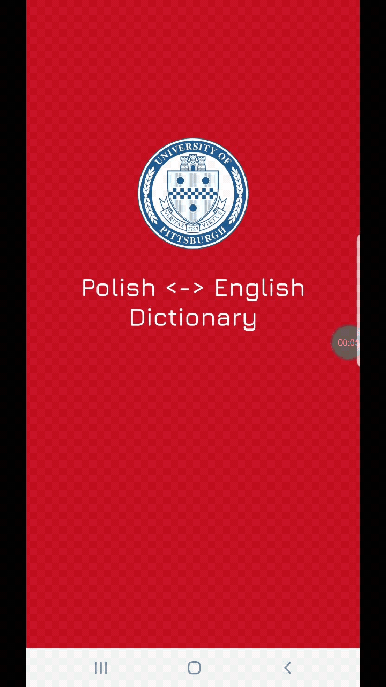

# Polish-English Dictionary Readme

This is an Android app that acts as a wrapper, plus some useful features such as bookmarking and search history on top of the Oscar Swan's Polish-English dictionary found on https://www.lektorek.org/polish/. 

App design can be viewed on Figma [here](https://www.figma.com/file/43WIc7Am6sUQDT2wlg9rof/Polish-English-Dictionary?node-id=35%3A389).

## Features

*  Native android app
*  Bilingual word search, grammar tables
*  Search history
*  Bookmarked word definitions

## Release Notes

All releases will be made available [here](https://github.com/hakanyildizhan/polish-english-dictionary/releases).